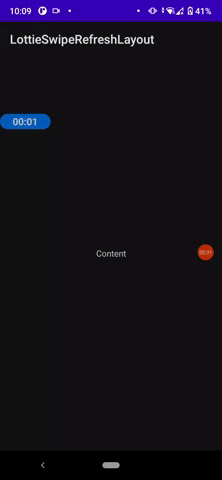
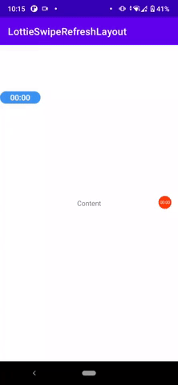
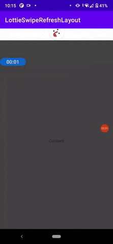

# LottieSwipeRefreshLayout

A custom `SwipeRefreshLayout` that shows a [Lottie View](https://github.com/airbnb/lottie-android) on top instead.

The main idea was to make it as similar to the AndroidX SwipeRefreshLayout as possible, so that they are easily interchangable.

</img>
</img>
</img>

## Basic usage

A `LottieSwipeRefreshLayout` accepts only one child.
See example for more detail.

```xml
<?xml version="1.0" encoding="utf-8"?>
<com.nabilmh.lottieswiperefreshlayout.LottieSwipeRefreshLayout xmlns:android="http://schemas.android.com/apk/res/android"
                                       xmlns:app="http://schemas.android.com/apk/res-auto"
                                       android:id="@id/swipe_refresh"
                                       android:layout_width="match_parent"
                                       android:layout_height="match_parent"
                                       app:lottie_rawRes="@raw/pull_to_refresh"
                                       >

    <android.support.v7.widget.RecyclerView
        android:id="@+id/recyclerView"
        android:layout_width="match_parent"
        android:layout_height="match_parent"/>

</com.nabilmh.lottieswiperefreshlayout.LottieSwipeRefreshLayout>
```

## Attributes

`max_offset_top`: The maximum distance in dp that the refresh indicator can be pulled beyond its resting position.
`indicator_overlay`: Whether to overlay the indicator on top of the content or not (default:true)
`trigger_offset_top`: The offset in dp from the top of this view at which the progress indicator should come to rest after a successful swipe gesture.

`lottie_rawRes`: The Lottie file to use. (placed in the raw folder)

## Extensible

You can use the base `SimpleSwipeRefreshLayout` to make your own pull to refresh view.

## How to add the library
Add it in your root build.gradle at the end of repositories:

	allprojects {
		repositories {
			...
			maven { url 'https://jitpack.io' }
		}
	}
Step 2. Add the dependency

	dependencies {
   	        implementation 'com.github.nabil6391:LottieSwipeRefreshLayout:1.0.0'
   	}
   
   
## Inspiration

This library took its original inspiration from https://github.com/timrijckaert/LottieSwipeRefreshLayout 